# 美股大型回撤的成因、可预测性与可交易性
## 一项基于 15 年数据的深度研究

> **研究区间** 2011-06 至 2026-06（3,772 个交易日） · **标的** S&P 500 与 Nasdaq 100
> **方法** 走向式样本外回测、三关信号验证协议、逐笔执行模拟 · **全部结论可由 `src/` 脚本复现**

---

## 执行摘要

本研究始于一个实务问题——**能否提前预知 SPX/NASDAQ 的大型回撤，并据此跑赢指数**——
并以三个层层递进的结论收束。三个结论的把握度依次升高，最后一个是数学确定性。

> **结论一（成因）** 大型回撤不是被某一类可提前押注的事件驱动的，而是**聚集于少数
> 波动率状态**。最强的单一预报因子是"上一次回撤"本身（自聚集），其解释力（1.9倍）
> 超过所有宏观日历因子（FOMC、非农、CPI）之和。
>
> **结论二（可预测性）** 市场的脆弱"状态"高度可测（次日回撤概率可在 1%↔25% 间分层，
> 跨度 25 倍），但具体"哪一天"不可测——**最严报警精度约 25%，即报警 4 次错 3 次，
> 这是公开数据的信息天花板**。加入更多已验证信号，模型边际增益为零。
>
> **结论三（可交易性）** 在 QDII 的 T+2 滞后与赎回费约束下，**任何择时策略都系统性
> 跑输买入持有**——不是参数没调好，而是一个数学不等式：在强上行漂移的资产上，
> 欠配拖累恒大于择时协方差。15 年里 17 次择时往返有 16 次是"卖低买高"。

**管理含义**：把工程预算从"预测涨跌的模型"转向"管理脆弱度的状态仪表"；把交易预期
从"择时套利"转向"默认满仓 + 极罕见的高把握防御"。本报告用 11 张 exhibit 逐层论证。

---

## 第一部分 · 问题与方法

### 1.1 研究设计的三个支柱

| 支柱 | 内容 | 防范的失败模式 |
|---|---|---|
| **无前视** | 所有特征仅用 T-1 及之前信息；走向式每 60 日重训 | 数据窥探、未来函数 |
| **三关验证** | 新信号须过增量关 / 显著关 / 模型关 | 单变量惊艳但多元无用 |
| **预注册证伪** | 阈值取分位数（非优化值）；零结果一律入库 | 事后叙事执法、幸存者偏差 |

### 1.2 事件定义

- **单日回撤**：收盘对收盘跌幅 > 1.3%（SPX 291 次，基准概率 7.7%；NDX 427 次，11.3%）
- **单周回撤**：周五对周五跌幅 > 3%（SPX 47 次；NDX 78 次）

---

## 第二部分 · 回撤的成因

### 2.1 回撤聚集于状态，而非散布于日历

**Exhibit 1** 显示 15 年全部 291 次单日回撤的分布。最醒目的事实不是它们何时发生，
而是它们**如何成簇**——红点密集落在 2018、2020、2022、2025 等高波动年份，而 2017
全年仅 3 次。回撤不是泊松式随机散布，而是状态依赖的。

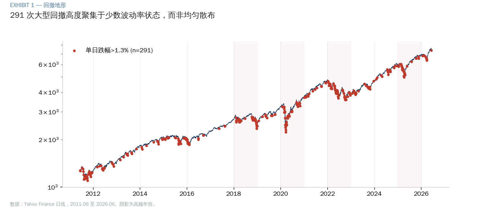

**Exhibit 2** 量化了这种不均匀：SPX 单日回撤的年度计数从 2017 年的 3 次到 2022 年的
43 次，跨度 14 倍。任何"恒定日频概率"的心智模型都是错的。

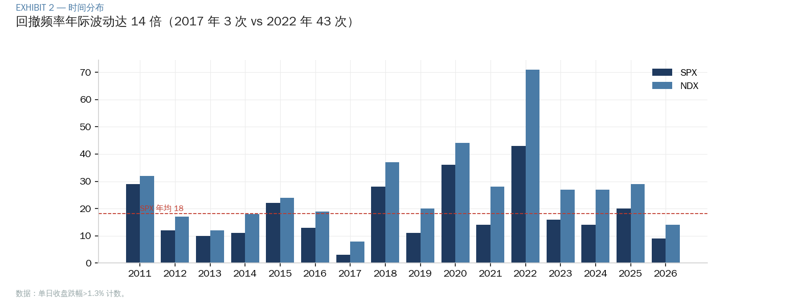

### 2.2 自聚集主导宏观日历

我们对全部 FOMC 决议、非农、CPI 窗口做了条件概率检验。**Exhibit 3** 是核心归因图：

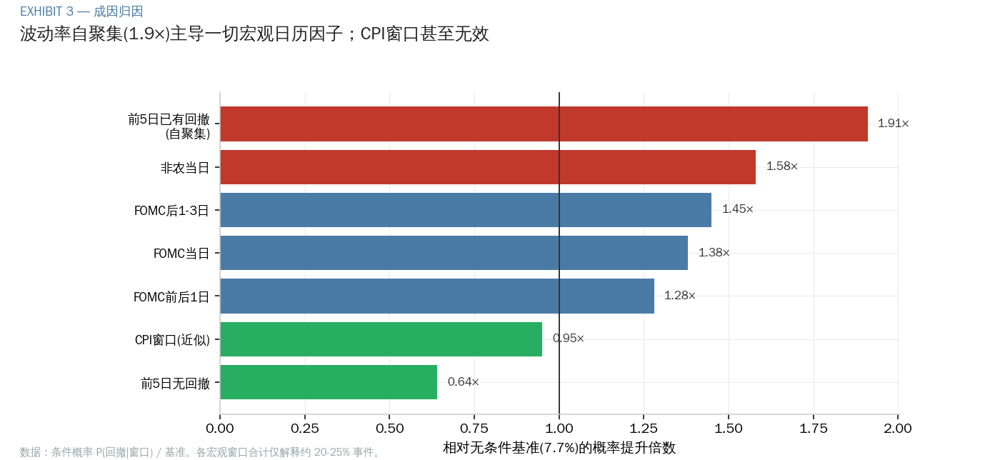

三个判读：

1. **宏观日历确有效应但有限**：非农当日概率提升 1.58 倍，FOMC 后三天 1.45 倍，
   且回撤偏向 FOMC **之后**——符合"市场提前定价、数据证伪预期后才跌"的逻辑。
2. **但全部宏观窗口合计仅解释约 20–25% 的事件**，CPI 窗口（近似）甚至无效（0.95×）。
3. **真正的统治性规律是自我聚集**：54% 的回撤发生在"前 5 日已有回撤"之后（1.9倍）。
   **回撤最好的预报员，是上一次回撤。**

### 2.3 触发器多变，放大机制恒定

逐一复盘 15 年重大回撤（2011 欧债、2015 人民币、2018 XIV 清盘、2020 疫情、
2022 加息、2024 套息平仓、2025 关税、2026 博通），得到一条清晰规律：

> **初始触发器每次都不同**（利率、汇率、疫情、政策、财报），因而不可预测；
> **放大机制高度重复**（拥挤持仓 + 负 gamma + 系统性策略的机械抛售），因而可观测。

这把研究焦点从"预测触发器"（不可能）转向"度量放大机制所需的易燃环境"（可行）。

---

## 第三部分 · 可预测性的边界

### 3.1 状态变量呈陡峭的单调梯度

**Exhibit 4** 展示四个状态变量按 T-1 五分位的次日回撤概率。每一个都单调、陡峭：

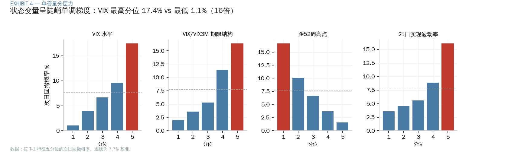

VIX 最高分位 17.4% vs 最低 1.1%（16 倍）；期限结构、实现波动率、距 52 周高点同样
呈现教科书式的单调分层。这证明"状态"携带真实信息。

### 3.2 状态信号通过，姿态信号全灭

我们检验了 13 个信号家族。**Exhibit 5** 是本研究最重要的一张图——"信号战场"：

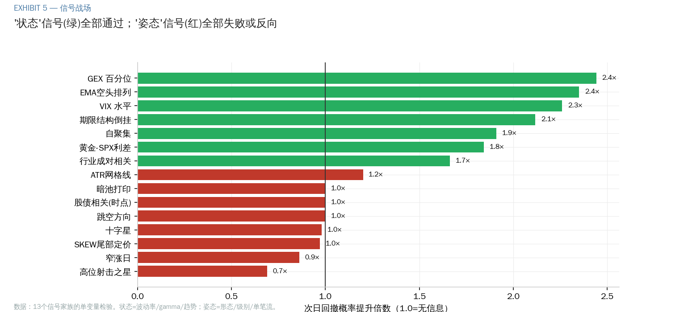

一条规律贯穿始终，且无一例外：

> **凡度量"状态"的信号（波动率、gamma、趋势、相关性）全部通过；
> 凡度量"姿态"的信号（蜡烛形态、跳空方向、暗池单笔打印、ATR级别触碰）全部失败或反向。**

市场不会用某个特定姿势预告回撤，但它会在回撤前换一种整体状态。

### 3.3 信息天花板：模型边际为零

最反直觉、也最重要的发现。把单变量最强的新信号（GEX 百分位、COR1M、黄金利差、
成对相关）逐一加入 12 特征基线模型，在严格对齐的样本上：

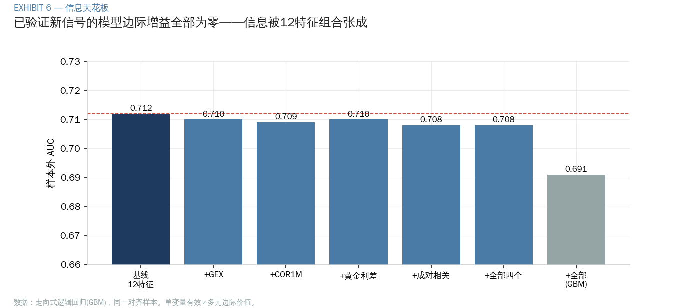

**Exhibit 6** 显示边际增益全部为零——连 GEX（单变量 5.7 倍分层、与 VIX 两度验证正交）
也不例外。原因：信息可被 12 个特征的线性组合张成；两两正交不等于多元边际价值。
**AUC 0.71–0.73 即公开日频状态变量的信息天花板。**

### 3.4 精度的现实上限

**Exhibit 7** 给出走向式样本外的精度-召回前沿：

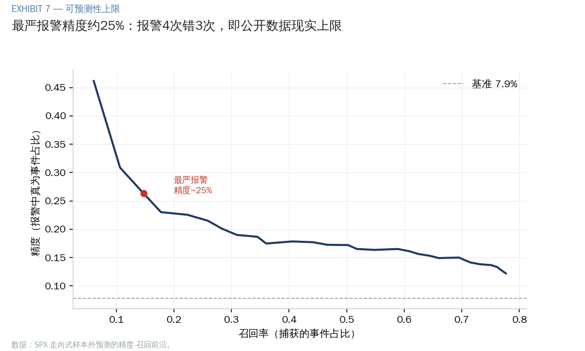

最严报警时精度约 25%——**报警 4 次错 3 次**。这不是模型不够好，而是结构性的：
触发事件本身不可预测，任何稳定的公开信号都会被套利掉。**任何声称显著更高精度的
产品，都应被要求出示样本外记录与误报率。**

---

## 第四部分 · 第三方信号与叙事的审计

本研究还系统检验了散户金融圈流行的多类付费信号与叙事，结论高度一致：

| 类别 | 宣称 | 实测裁决 |
|---|---|---|
| 经销商 gamma 日报 | GEX 翻转、级别"守住" | GEX 状态属实且有用；级别剧场不可证伪、跌破即改口 |
| 暗池打印 alert | "机构在买入" | 方向是猜的（中点成交）、场所标签是 TRF 非暗池、SPY/QQQ 大宗是申赎管道 |
| Saty Pivot Ribbon | 趋势识别 | EMA 排列**有效**（空头 18.1%，与 VIX 正交），已入清单 |
| Saty ATR Levels | 高抛低吸 | 网格线**无效**（1.2×），斐波系数无统计特殊性 |
| 蜡烛形态/十字星 | 顶部信号 | VIX 控制后归零；高位射击之星甚至反向（0.69×） |
| 形态类比预测 | 匹配历史反弹 | 技能为零（Spearman 0.025），恐慌日上 0.007 |

**贯穿性教训**：有效的内核（GEX 状态、EMA 趋势、波动率归一化）几乎都可由免费数据
复现；付费产品的增值部分往往是包在内核外的不可证伪叙事。判别试金石：**评判任何
级别/区间预测，先问三件事——宽度多少？基准命中率多少？击穿了算谁的？**

---

## 第五部分 · 可交易性——择时能否跑赢买入持有

这是本研究投入最深、也最具决定性的部分。问题：在中国 QDII 基金的 T+2 滞后、
1.5%/0.5% 赎回费、lot 会计约束下，用我们验证过的最强信号择时，能否跑赢买入持有？

### 5.1 净值证据：系统性跑输

**Exhibit 8** 是最优择时策略（出场 + 智能买回 + T+2 + 赎回费）对买入持有的净值对比：

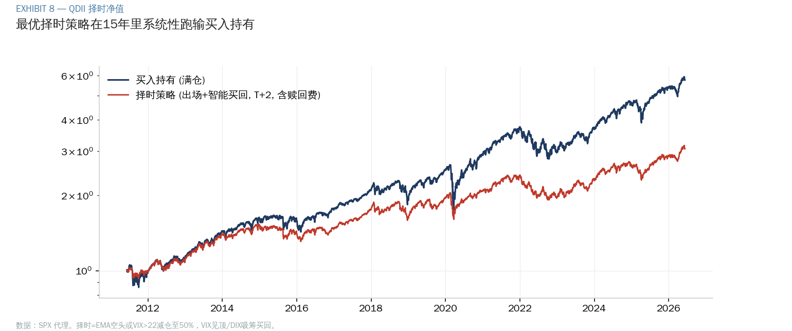

15 年全程跑输。这促使我们逐层拆解原因，而每一层都被你（委托方）的追问推进。

### 5.2 机制：卖低买高（16/17）

**Exhibit 9** 把 17 次择时往返逐笔画出——横轴出场价、纵轴买回价：

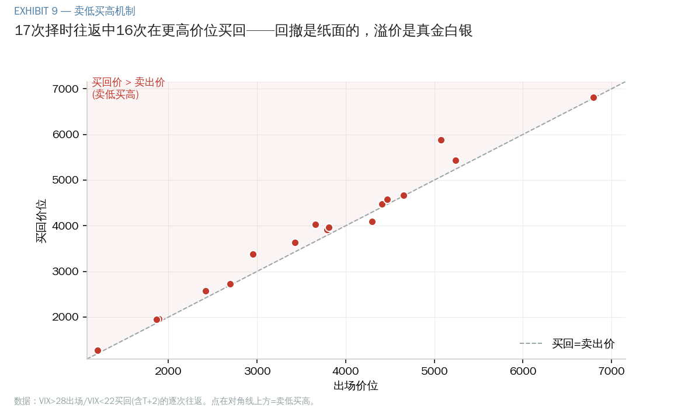

**17 次里 16 次落在对角线上方，即买回价高于卖出价。** 唯一的例外是 2022 慢熊。
两个机制：①触发出场的 VIX 飙升发生在市场**已经跌完**之后（实际躲过的回撤中位仅
2.7%）；②买回信号在反弹**已经走了一截**后才确认，叠加 T+2 滞后。
**你躲过的回撤是纸面的、会收复；你为买回多付的溢价是真金白银、永久损失。**

### 5.3 数学的墙：欠配拖累 > 择时协方差

最终极的证明。任何策略的收益满足恒等式 **E[w·r] = E[w]·E[r] + Cov(w,r)**。
**Exhibit 10** 在不同底仓水平下分解这两项：

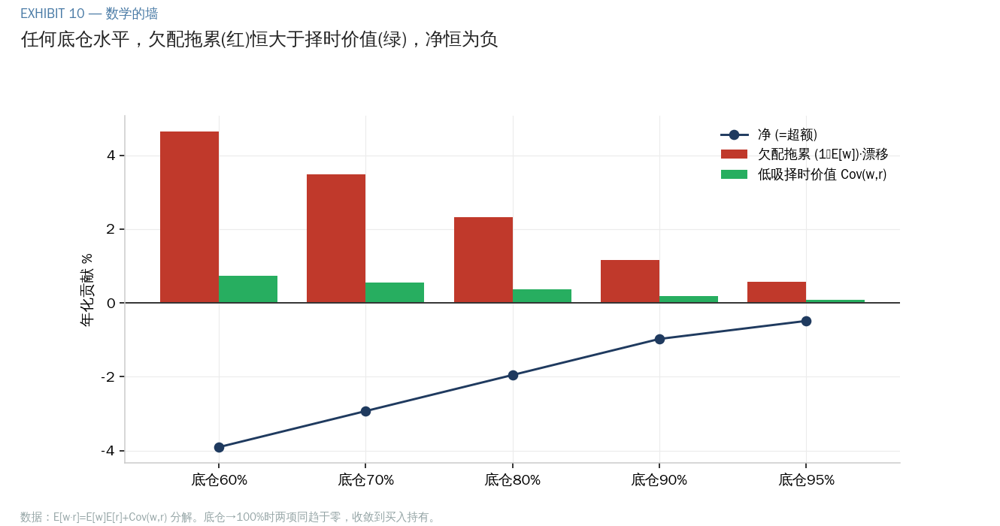

- **低吸择时确有价值**（绿柱 Cov(w,r) 恒为正）——你的直觉没错；
- **但欠配拖累（红柱）在每个底仓水平都更大**——为了留子弹低吸，平均仓位必然 < 100%，
  而 SPX 年漂移 +13.2%，每一块不在场的钱的机会成本超过低吸赚回的；
- 把子弹缩到零（底仓→100%），两项同趋于零，**策略从下方收敛到买入持有，永不超越**。

> 跑赢的唯一两条路：**加杠杆**（仓位 >100%，QDII 做不到）或**换一个无强漂移的市场**
> （横盘/熊市，正是 2022 年择时唯一获胜的情形）。

### 5.4 重新定位：择时是保险，不是 alpha

**Exhibit 11** 把择时的真实价值定位在"保险定价前沿"上：

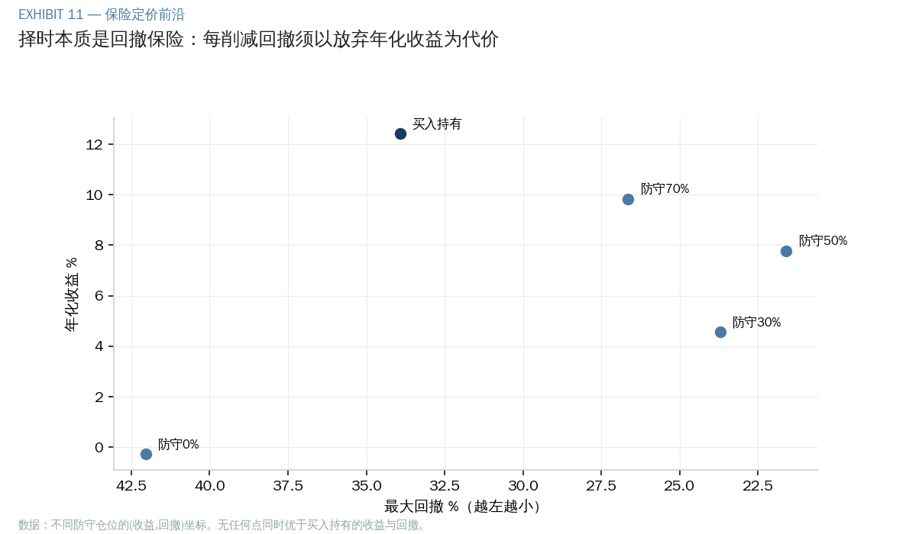

没有任何一点同时优于买入持有的收益与回撤。择时能买到的是**更小的回撤**
（防守 50% 把回撤从 34% 压到 22%），代价是**确定的年化保费**（约 4.5%）。
这是回撤保险的定价表，不是超额收益的来源。

---

## 第六部分 · 综合结论与建议

### 6.1 三个把握度递增的结论

```
成因   ├─ 回撤聚集于波动率状态；自聚集(1.9×) > 宏观日历之和    [统计规律]
可预测 ├─ 状态可分层(1%↔25%)，时点不可测；精度上限~25%        [经验上限]
可交易 └─ 择时数学上跑输买入持有；欠配拖累 > 择时协方差         [数学确定]
```

### 6.2 行动建议

| 领域 | 建议 | 依据 |
|---|---|---|
| **预测系统** | 输出"脆弱度状态分档"而非"涨跌点预测"；冻结 12 特征模型 | 信息天花板已达（Exhibit 6-7） |
| **数据预算** | 免费层已覆盖全部信号轴；付费仅期权链一项明确高 ROI | 模型边际为零 |
| **第三方信号** | 自建免费内核（GEX/EMA/波动率），不买级别/打印/形态产品 | 第四部分审计 |
| **QDII 交易** | 默认满仓；仅在极罕见高把握的持续性熊市做一次防御 | 择时结构性跑输（第五部分） |
| **风险管理** | 若需要更平稳，按"保险定价前沿"明码标价地购买回撤保护 | Exhibit 11 |

### 6.3 最深的一句话

> 你想跑赢的那个东西——满仓持有一个长期强涨的指数——它**赢就赢在"永远满仓吃满
> 漂移"**。任何让你离场的操作，无论信号多聪明、分批多精细，都是在主动放弃它赖以
> 获胜的优势。预测的价值不在于跑赢它，而在于**在你必须降低波动时，让你为此付出
> 尽可能小、且明码标价的代价**。

---

## 附录 · 方法、数据与复现

**数据**（全部免费）：Yahoo Finance 日线（SPX/NDX/VIX 族/行业 ETF/SOX/黄金/日元）、
SqueezeMetrics DIX+GEX 15 年历史、CBOE 指数族（COR/DSPX/VX 期货曲线）、
CFTC COT、FRED（NFCI/HY OAS）。

**核心脚本**：
- 成因：`detect_events.py` `calendar_factors.py` `precursor_analysis.py`
- 可预测性：`predict_model.py` `model_v2.py`（模型关）`ndx_native_features.py`
- 信号审计：`saty_indicators_test.py` `candlestick_test.py` `analog_forecast.py`
  `darkpool_gex.py` `correlation_factors.py` `jpy_gold_breadth_test.py`
- QDII：`qdii_feasibility.py` `qdii_roundtrip.py` `qdii_scalein.py`
  `exit_selectivity.py` `threshold_grid.py` `ladder_2d.py` `episode_trace.py`
- 图表：`make_exhibits.py`

**局限**：价格为收盘数据，未含盘中（SPX 事件日中位仅 12.5% 跌幅在隔夜）；
CPI 精确日历与 HY OAS 全史受本环境网络限制未竟；QDII 以 SPX 为净值代理，
未含汇率与跟踪误差（接口已预留）。

**诚实边界**（随每份输出附带）：本体系预测脆弱状态而非具体日期；最严报警精度
约 25% 是公开数据现实上限；触发事件本身不可预测，可预测的是市场对冲击的脆弱度。
