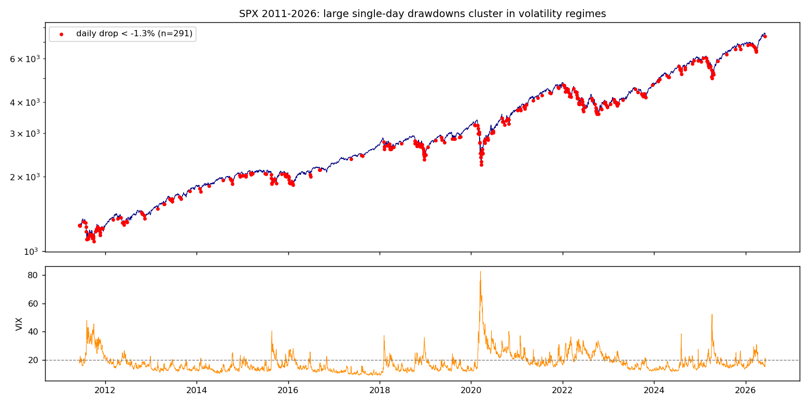
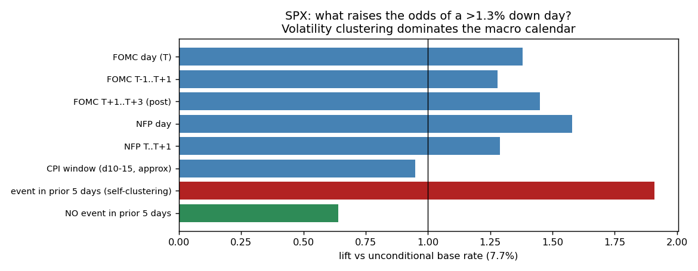
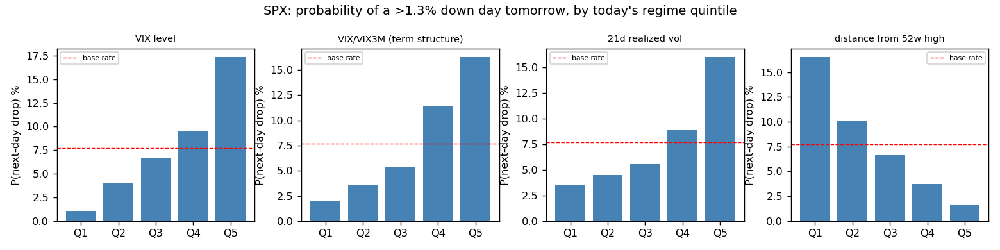
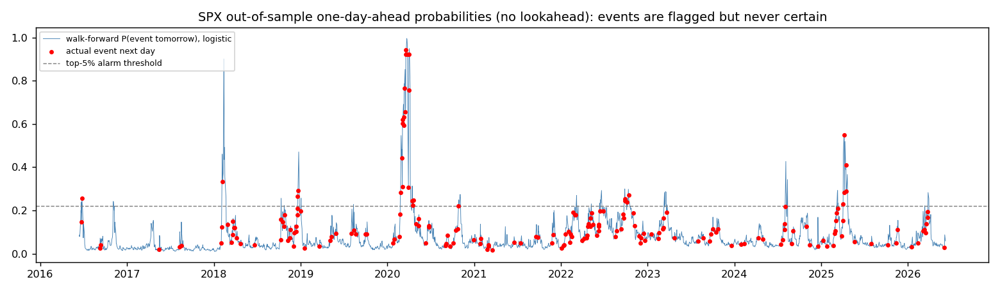

# SPX 500 / NASDAQ 100 大型回撤的成因与可预测性分析（2011–2026）

> 数据区间：2011-06-09 至 2026-06-09（整 15 年）。数据源：Yahoo Finance 日线收盘价。
> 事件定义：**单日回撤** = 收盘对收盘跌幅 > 1.3%；**单周回撤** = 周五对周五跌幅 > 3%。
> 全部代码在 `src/`，可复现；中间结果在 `output/`，图表在 `figures/`。

---

## 一、事件全景

| 指标 | SPX | NDX |
|---|---|---|
| 交易日总数 | 3,772 | 3,772 |
| 单日事件数（< -1.3%） | **291**（基准概率 7.7%） | **427**（11.3%） |
| 单周事件数（< -3%） | **47**（6.0%） | **78**（10.0%） |
| 最差单日 | 2020-03-16，-11.98% | 2020-03-16，-12.19% |
| 最差单周 | 2020-03-20 当周，-14.98% | 2020-03-20 当周，-12.52% |

最重要的结构性事实是**事件极度不均匀**：SPX 单日事件 2017 年只有 3 次，2022 年却有 43 次；2020 年 36 次。事件不是随机散布的，而是成簇出现在"波动率状态"（volatility regime）里。



---

## 二、归因：到底是什么导致了这些下跌？

### 2.1 假说一："市场在提前押注关键经济数据" —— 部分成立，但只能解释少数事件

我们对 15 年间全部 FOMC 决议日（122 个，含 2020 年两次紧急降息）、非农（NFP，每月第一个周五）、CPI 发布窗口（每月 10–15 日的工作日，近似处理）做了条件概率检验：

| 窗口（SPX） | P(暴跌\|窗口) | 提升倍数 | 覆盖全部事件的比例 |
|---|---|---|---|
| FOMC 决议当日 | 10.7% | 1.38× | 4.5% |
| FOMC 后 1–3 个交易日 | 11.2% | **1.45×** | 14.1% |
| 非农当日 | 12.2% | **1.58×** | 7.6% |
| CPI 窗口（近似） | 7.3% | 0.95× | 19.2% |
| **前 5 天内已发生过暴跌** | **14.7%** | **1.91×** | **54.0%** |
| 前 5 天内无暴跌 | 5.0% | 0.64× | 46.0% |



结论很清晰：

1. **宏观数据日确实有提升效应**（非农日 1.58 倍、FOMC 后三天 1.45 倍），且模式符合"押注落空"逻辑——暴跌更多发生在 FOMC **之后**而非之前，即市场提前定价、数据/表态证伪预期后才崩。2022 年是典型（多次 CPI 与 FOMC 日单日跌幅超 3%），2026-06-05 也是（超强非农 17.2 万 → 加息预期回归 → NDX -4%）。
2. **但日历因素总共只能解释约 20–25% 的事件**。即使把所有宏观窗口加起来，仍有大多数暴跌发生在"普通日子"。
3. **真正的统治性规律是自我聚集（vol clustering）**：54% 的暴跌发生在"前 5 天内已有暴跌"之后。暴跌最好的领先指标，是另一次暴跌。

### 2.2 假说二："结构崩坏 / 期权流（GEX、gamma 池）" —— 是放大器，不是扣扳机的手

先说数据上的诚实话：**免费渠道没有可靠的 15 年期历史做市商 gamma 敞口（GEX）数据**（SqueezeMetrics、SpotGamma、Menthor Q 等均为付费且历史有限），因此本仓库无法直接回测 GEX。但我们可以用两类证据逼近这个问题：

**(a) 代理变量证据。** VIX 期限结构（VIX/VIX3M 比值）是负 gamma 状态的较好公开代理——当短端隐含波动率高于长端（比值 > 1，期限结构倒挂）时，通常对应做市商负 gamma、对冲行为顺势放大波动。数据上它是最强的前兆之一：

- 比值处于最高五分位时，次日暴跌概率 **16.3%**；最低五分位仅 **2.0%**（8 倍差距）。
- 事件前一天的中位数比值为 0.938，平时为 0.880。

**(b) 个案证据。** 15 年里被广泛证实由期权/系统性流动主导的暴跌只有少数几次：2018-02-05（XIV 清盘，做空波动率产品的 gamma 螺旋）、2024-08-05（日元套息平仓 + 负 gamma 放大）、以及 2020 年 3 月（波动率目标基金与风险平价的机械去杠杆）。它们的共同特征是：**初始冲击来自别处（利率、汇率、疫情），期权与系统性资金流把 -1% 放大成 -4%**。

> 结论：gamma/GEX 决定的是下跌的**烈度和速度**，而不是下跌**是否发生**。把它当成"原因"会找错方向；把它当成"放大器状态指标"（通过期限结构倒挂观察）则非常有用。

### 2.3 历次重大回撤的实际触发因素（叙事归因）

| 时期 | 最差单周 | 初始触发 | 放大机制 |
|---|---|---|---|
| 2011-08 | -7.2% | 美债评级下调 + 欧债危机 | 流动性挤兑 |
| 2015-08 | -5.8% | 人民币意外贬值 | 系统性策略去杠杆、ETF 闪崩 |
| 2016-01 | -6.0% | 中国增长恐慌 + 油价崩盘 | 主权基金抛售 |
| 2018-02 | -5.2% | 工资数据超预期 → 利率恐慌 | **XIV/做空波动率 gamma 螺旋** |
| 2018-12 | -7.1% | Fed 缩表"自动驾驶"表态 | 年末流动性枯竭 |
| 2020-02/03 | -15.0% | COVID | 风险平价/波动率目标基金机械抛售 |
| 2022 全年 | -5.8%（6 月） | CPI 持续超预期 → 激进加息 | 估值压缩，事件集中在 CPI/FOMC 日 |
| 2024-08 | -4.2% | 日本加息 → 套息交易平仓 | 负 gamma + 流动性真空（VIX 盘中 65） |
| 2025-04 | -9.1% | 对等关税宣布 | 政策不确定性、强制去杠杆 |
| 2026-03 | NDX 进入回调 | AI 资本开支回报质疑 + 中东地缘 + 关税 | 高估值动量股的拥挤平仓 |
| 2026-06-05 | SPX -2.6%、NDX -4% | 博通 AI 指引不及预期 + 超强非农→加息预期 | 半导体板块单日蒸发 1 万亿美元 |

模式总结：**触发因素每次都不一样**（利率、汇率、疫情、政策、财报），无法预测具体扣扳机的事件；但**放大机制高度重复**（拥挤持仓 + 负 gamma + 系统性策略的机械卖出），而放大机制所需的"易燃环境"是可以提前观测的。

---

## 三、"提前一天预知"的诚实答案

### 3.1 事件前一天，市场长什么样？

暴跌前一天（T-1）的市场状态与平时有系统性差异（SPX，中位数对比）：

| 指标（T-1 收盘） | 暴跌前夜 | 平时 |
|---|---|---|
| VIX | **21.0** | 16.1 |
| VIX 5 日变化 | **+0.69** | -0.21 |
| VIX/VIX3M | **0.938** | 0.880 |
| VVIX | **102.9** | 93.2 |
| MOVE（债券波动率） | **83.9** | 71.0 |
| 21 日实现波动率 | **16.7** | 11.9 |
| 距 52 周高点 | **-5.6%** | -1.5% |
| 前 5 日收益 | **-0.4%** | +0.5% |
| HYG 20 日收益（信用） | **-0.5%** | +0.6% |

注意 SKEW 指数（尾部风险定价）在暴跌前**没有**区分度（127.3 vs 130.6，方向甚至相反）——市场为尾部付的保费并不能预报尾部。



### 3.2 严格无前视的预测回测（2016–2026 样本外）

用仅含 T-1 可得信息的 12 个特征（VIX、期限结构、VVIX、MOVE、实现波动率、52 周回撤、信用、宽度等），expanding-window 每 60 日重训，逻辑回归与梯度提升各跑一遍：

| | SPX | NDX |
|---|---|---|
| 样本外 AUC（逻辑回归） | **0.726** | 0.643 |
| 样本外基准概率 | 7.9% | 12.4% |
| 报警最严（top 5% 天数）时精度 | **25.4%**（3.2× 提升） | 22.2%（1.8×） |
| 此时召回率 | 16.2% | 9.0% |
| 透明规则：VIX>20 且 VIX/VIX3M>0.95 | 精度 19.2%，召回 36% | 精度 22.7%，召回 27% |



### 3.3 你要的那个"极为稳定的答案"

**稳定的负结论：不存在能稳定地提前一天预知"明天会暴跌"的方法。** 这不是数据或模型不够好——而是结构性的：

1. 触发事件（关税推文、央行意外、财报、疫情）本身大多不可预测；
2. 任何公开可得的稳定预测信号都会被套利掉（卖出明日期权/做空对冲会立即改变定价）；
3. 我们最好的模型在最严格报警时也只有约 25% 精度——**报警 4 次错 3 次**，这已经是公开数据的现实上限，任何声称更高的产品都值得怀疑。

**同样稳定的正结论：你不需要预测"哪一天"，预测"哪种状态"就够了，而状态是高度可预测的。** 数据给出的分层极其陡峭：

- 处于"安全状态"（VIX 最低五分位 + 接近 52 周高点 + 前 5 日无暴跌）时，次日暴跌概率约 **1%**；
- 处于"易燃状态"（VIX>20、期限结构趋平/倒挂、已跌破 52 周高点 5%、近 5 日已有暴跌、信用利差走宽）时，次日概率升到 **15–25%**，即 15–25 倍的差距。

实务上等价于"提前一天预知"的，是每天收盘后跑这张**清单**（已实现于 `src/`，所有数据免费可得）：

1. **VIX > 20？**（次日风险约 2.3 倍）
2. **VIX/VIX3M > 0.95？**（期限结构趋平 = 负 gamma 代理，约 2 倍）
3. **VIX 过去 5 日上行 > 2 点？**
4. **指数已低于 52 周高点 5% 以上？**
5. **过去 5 个交易日内已出现过 >1.3% 的下跌？**（最强单一信号，1.9 倍）
6. **HYG 过去 20 日为负？**（信用先行确认）
7. **明天/后天是 FOMC 决议次日或非农日，且上述任一项已亮灯？**（日历乘数 1.4–1.6 倍）

0–1 项亮灯 → 正常持仓；3 项以上亮灯 → 你已处于历史上产生了绝大多数暴跌的状态，此时尾部保护（put spread、降杠杆）的期望成本远低于平均状态下常备对冲的成本。**这是用公开数据能做到的、可复现的、统计上稳定的极限。**

---

## 四、方法与局限

- 价格为 Yahoo Finance 收盘数据，未含盘中跌幅；周定义为 W-FRI 重采样。
- CPI 发布日采用"每月 10–15 日工作日"近似（精确日期需逐年抓取 BLS 日历），FOMC 日期为手工核对的决议日清单（`src/calendar_factors.py`），非农为每月第一个周五。
- 无免费历史 GEX/dealer gamma 数据，以 VIX 期限结构与 VVIX 作公开代理；个别月份精确的 gamma 翻转位无法回测。
- 回测为统计检验而非交易策略：未计入交易成本、未优化阈值（阈值取分位数以避免数据窥探）。
- 2026 年 3 月与 6 月事件的叙事归因参考公开报道（CNN、CNBC、TheStreet、Howland Capital 2026Q1 回顾）。

## 复现

```bash
pip install pandas numpy matplotlib yfinance scikit-learn statsmodels
python3 src/download_data.py      # 下载全部数据
python3 src/detect_events.py      # 识别回撤事件
python3 src/calendar_factors.py   # 宏观日历归因
python3 src/precursor_analysis.py # 事件前兆分析
python3 src/predict_model.py      # 走向式预测回测
python3 src/make_charts.py        # 生成图表
```
